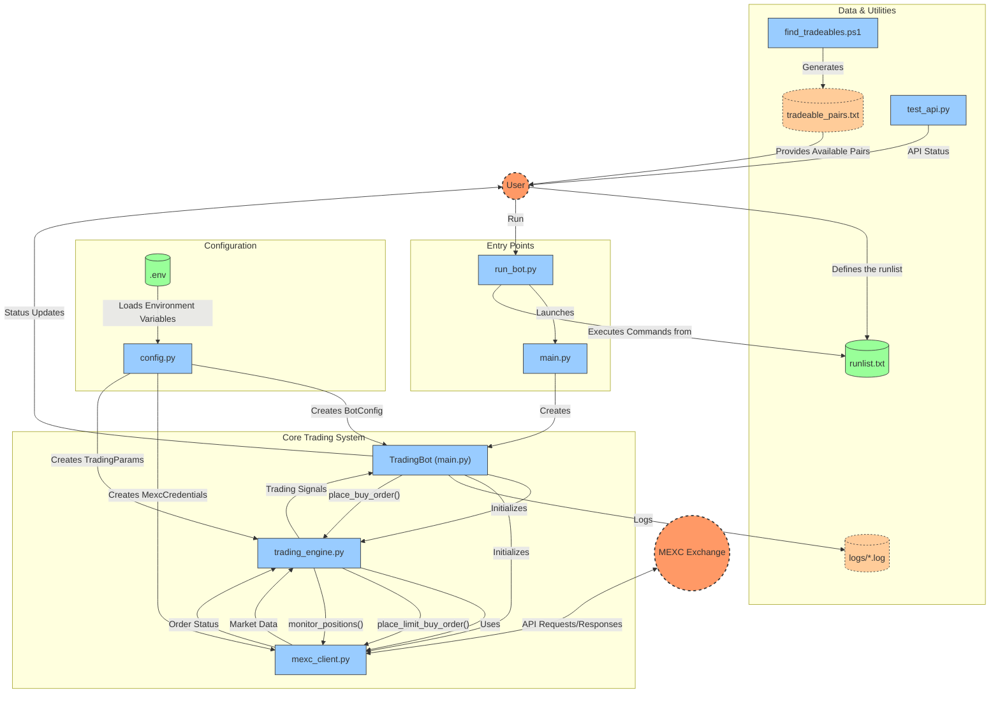

# MEXC⚡: High-Performance Crypto Trading Bot for MEXC Exchange


<!-- [](#) -->
<!-- [](#) -->

[](#)
[](#)
[](#)
[](#)
[](#)
[](#)
[](https://github.com/n-azimi/MEXC?tab=readme-ov-file#%EF%B8%8F-important-notices--risk-warnings)
[](https://mexc.com/)
[](#)
[](https://github.com/n-azimi/MEXC/commits/main)
[](LICENSE)


## 📋 Table of Contents
1. [🎯 Overview](#-overview)
2. [🏗️ Architecture & Component Analysis](#%EF%B8%8F-architecture--component-analysis)
3. [⚙️ Installation & Setup](#%EF%B8%8F-installation--setup)
4. [📁 Code Structure & Usage](#-code-structure--usage)
5. [📄 License](#-license)
6. [⚠️ Important Notices & Risk Warnings](#%EF%B8%8F-important-notices--risk-warnings)


## 🎯 Overview

### Purpose & Functionality
MEXC⚡ is a complex, production-ready trading bot designed for the MEXC cryptocurrency exchange. The bot provides automated trading capabilities with advanced risk management features, focusing on high-performance execution and comprehensive position monitoring.

**Core Capabilities:**
- **🤖 Automated Trading**: Execute buy/sell orders with precise timing and conditions
- **🎯 Sequential Bracket Orders**: Advanced strategy combining entry, stop-loss, and take-profit orders
- **🛡️ Risk Management**: Automatic stop-loss placement and position monitoring
- **⏰ Time-Based Trading**: Configurable trading windows for specific time periods
- **💵 USDT-Based Positioning**: Simplified position sizing using dollar amounts
- **📊 Real-Time Monitoring**: Continuous position tracking with protective order management


## 🏗️ Architecture & Component Analysis

### Architecture Overview

The MEXC⚡ trading bot follows a modular, async-first architecture designed for high performance and reliability:




### Component Breakdown

#### 1. **🔰 main.py**
- **Role**: CLI interface and application orchestration
- **Key Functions**:
  -  Command-line argument parsing
  -  Bot lifecycle management
  -  Time-based execution scheduling
  -  Error handling and graceful shutdown


#### 2. **📈 Trading Engine** (trading_engine.py)
- **Role**: Core trading logic and strategy execution
- **Key Functions**:
  -  Order placement and management
  -  USDT-based quantity calculation
  -  Stop-loss automation
  -  Position monitoring and lifecycle management
  -  Sequential bracket order implementation
  -  Risk management protocols


#### 3. **🔌 MEXC Client** (mexc_client.py)
- **Role**: High-performance MEXC API client
- **Key Functions**:
  -  Async HTTP client with connection pooling
  -  HMAC SHA256 authentication
  -  Rate limiting and request throttling
  -  Symbol validation and exchange info retrieval
  -  Multiple order type support
  -  Error handling and retry mechanisms


#### 4. **⚙️ Configuration** (config.py)
- **Role**: Configuration management and validation
- **Key Functions**:
  -  Environment variable loading
  -  Default value management
  -  Credential handling


## ⚙️ Installation & Setup

### 📋 Prerequisites
- **🐍 Python 3.8+** (recommended: Python 3.9 or higher)
- **🏦 MEXC Exchange Account** with API access enabled
- **🔑 Valid API credentials** with trading permissions
- **💻 Windows/Linux** compatible

### 💿 Step-by-Step Installation

#### 1. Environment Setup
```bash
# Create virtual environment (recommended)
python -m venv mexc_env
source mexc_env/bin/activate  # Linux
# or
mexc_env\Scripts\activate     # Windows
# or
conda activate your_environment_name     # If you're using conda

# Install dependencies
pip install -r requirements.txt
```


#### 2. API Configuration
```bash
# Copy environment template
cp env_example.txt .env

# Edit .env with your credentials
# Required:
MEXC_API_KEY=your_actual_api_key_here
MEXC_SECRET_KEY=your_actual_secret_key_here

# Optional but recommended:
DRY_RUN=true                    # Start in test mode
TRADING_SYMBOL=XRPUSDT          # Default trading pair
TRADING_QUANTITY=2.0          # Default order size (USDT)
```

#### 3. Verification
```bash
# Test MEXC API
python test_api.py

# Test API connectivity
python main.py --action test-permissions

# Validate your trading symbol
python main.py --action validate --symbol XRPUSDT

# Find tradeable symbols
python main.py --action symbols --search BTC
```

Execute the PowerShell script below to generate a `tradable_pairs.txt` file.
This file will list all symbols that support **spot trading** on the MEXC exchange.

```powershell
.\find_tradeables.ps1
```

### 📦 Dependencies Analysis

**Core Dependencies:**

```1:12:requirements.txt
requests>=2.31.0
aiohttp>=3.9.0
asyncio>=3.4.3
python-dotenv>=1.0.0
pydantic>=2.5.0
pytz>=2023.3
schedule>=1.2.0
websockets>=12.0
cryptography>=41.0.0
pandas>=2.1.0
numpy>=1.25.0
loguru>=0.7.0
```

|  Package |  Purpose |
|---------|---------|
| `🌐 aiohttp` | High-performance async HTTP client |
| `✅ pydantic` | Data validation and configuration management |
| `📝 loguru` | Advanced logging with rotation |
| `🔐 cryptography` | HMAC authentication for MEXC API |
| `🌍 python-dotenv` | Environment variable management |


## 📁 Code Structure & Usage

**Code Structure:**

```
📁 MEXC/
├── 📚 docs/                      # Documentation
├── 📝 logs/                      # Application logs
│   └── MEXCL_2025-07-13.log
├── 🚀 main.py                    # Entry point with core application logic
├── ⚙️ run_bot.py                 # Bot execution script
├── ⚡ trading_engine.py          # Core trading logic and strategies
├── 🔗 mexc_client.py             # MEXC API client implementation
├── 🔧 config.py                  # Configuration management
├── 🧪 test_api.py                # API testing utilities
├── 📋 runlist.txt                # List of commands to run
├── 📊 tradeable_pairs.txt        # List of available trading pairs
├── 🔍 find_tradeables.ps1        # PowerShell script to find tradeable pairs
├── 📦 requirements.txt           # Project dependencies
├── 🔒 .env                       # Environment variables and API keys
├── 🌍 env_example.txt            # Environment variable template
└── 📖 README.md                  # Primary documentation
```


**Usage:**

1. **Define your run list**

    Create a file named `runlist.txt` and list the commands you want to run, one per line.
    Each line should be a valid shell command, such as:
    
    ```txt
    python main.py --action test-permissions
    python main.py --action symbols --search BTC
    ```
    
    > `runlist.txt` is used to queue commands for execution.
    

    The following commands are available:

    ```
    usage: main.py [-h]
                   [--action {start,buy,sell,status,symbols,validate,test-permissions,find-tradeable,debug-tpsl,test-tpsl-types,bracket,sequential,simple-bracket}]
                   [--price PRICE]
                   [--quantity QUANTITY]
                   [--symbol SYMBOL]
                   [--search SEARCH]
                   [--dry-run]
                   [--config CONFIG]
                   [--time TIME]
                   [--timezone TIMEZONE]
                   [--stop-loss STOP_LOSS]
                   [--take-profit TAKE_PROFIT]
    ```

    ```
    options:
      -h, --help
          Show this help message and exit.
    
      --action {start,buy,sell,status,symbols,validate,test-permissions,find-tradeable,debug-tpsl,test-tpsl-types,bracket,sequential,simple-bracket}
          Specify the action the bot should perform:
            start             Start the trading bot with the current configuration.
            buy               Place a buy order for the specified symbol.
            sell              Place a sell order for the specified symbol.
            status            Show the current bot status or open positions.
            symbols           List all available trading symbols on MEXC.
            validate          Validate the current configuration file.
            test-permissions  Test API permissions for your MEXC account.
            find-tradeable    List symbols that are currently tradeable.
            debug-tpsl        Debug take-profit/stop-loss logic.
            test-tpsl-types   Test various TP/SL order types.
            bracket           Place a bracket order (entry, take-profit, stop-loss).
            sequential        Place sequential bracket orders.
            simple-bracket    Place a simplified bracket order with basic parameters.
    
      --price PRICE
          Specify the price for buy/sell orders. Required for limit orders.
    
      --quantity QUANTITY
          Amount of the asset to buy or sell in the order. Accepts decimal values.
    
      --symbol SYMBOL
          Trading symbol to use for the order (e.g., XRPUSDT). Overrides default symbol in config.
    
      --search SEARCH
          Search term to filter symbols when using the 'symbols' or 'find-tradeable' actions.
    
      --dry-run
          Enable dry run mode: simulate actions without executing real trades on MEXC.
    
      --config CONFIG
          Path to a custom configuration file.
    
      --time TIME
          Schedule order execution at a specific time (format: HH:MM or HH:MM:SS, 24-hour).
    
      --timezone TIMEZONE
          Timezone for scheduled orders (default: America/New_York). Accepts any valid IANA timezone string.
    
      --stop-loss STOP_LOSS
          Set stop-loss price for bracket or sequential orders. Triggers a sell if price drops to this level.
    
      --take-profit TAKE_PROFIT
          Set take-profit price for bracket or sequential orders. Triggers a sell if price rises to this level.
    ```
   
    

3. **Run the bot**

    Start the runner script using:
    
    ```bash
    python run_bot.py
    ```
    
    This script will read each line from `runlist.txt` and execute the commands **sequentially**.
    
    * Each command will **only start after the previous one finishes**.
    * To run commands in **parallel**, simply open multiple terminal windows and run `python run_bot.py` in each one using different `runlist.txt` files (or selectively modify the file).


## 📄 License

This software is licensed under the GNU General Public License v3.0 (GPLv3). You are free to use, modify, and distribute this software for both personal and commercial purposes, as long as you comply with the terms of the GPLv3 license. This includes preserving the license notice and making the source code of any derivative works available under the same license.


## ⚠️ Important Notices & Risk Warnings

### Disclaimer

This project is an independently developed software tool and is not affiliated with, endorsed by, or officially supported by MEXC. It is provided "as is", without any warranties or guarantees of performance or profitability. Cryptocurrency trading involves a substantial risk of financial loss, and by using this software, you acknowledge that you are solely responsible for any actions taken and any outcomes resulting from its use. The developer assumes no liability for any losses, damages, or legal issues that may arise from its use. Users are responsible for complying with local regulations and the terms of service of the exchange.

### Security Guidelines

* Never commit API keys to version control.
* Enable IP whitelisting on your MEXC API keys for added protection.

### API Usage & Limits

* Adhere to MEXC’s API rate limits.
* Monitor usage to avoid throttling.

### Trading Risk Reminders

* Cryptocurrency trading involves significant financial risk.
* Always start in dry-run mode to test configurations.
* Begin with small amounts when going live.
* Monitor performance regularly.
* Understand that stop-losses may not always trigger as expected in volatile markets.


