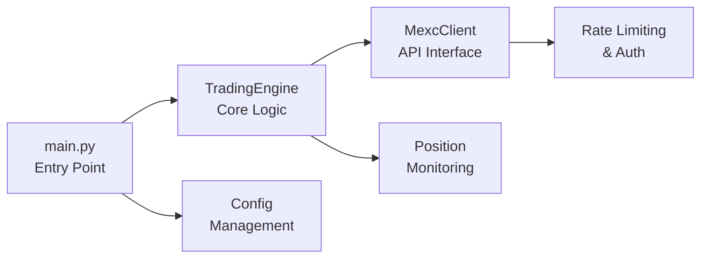

# MEXC⚡: High-Performance Crypto Trading Bot for MEXC Exchange


## 📋 Table of Contents
1. [🎯 Overview](#overview)
2. [🏗️ Architecture & Component Analysis](#architecture--component-analysis)

---

## 🎯 Overview

### Purpose & Functionality
MEXC⚡ is a complex, production-ready trading bot designed for the MEXC cryptocurrency exchange. The bot provides automated trading capabilities with advanced risk management features, focusing on high-performance execution and comprehensive position monitoring.

**Core Capabilities:**
- **🤖 Automated Trading**: Execute buy/sell orders with precise timing and conditions
- **🎯 Sequential Bracket Orders**: Advanced strategy combining entry, stop-loss, and take-profit orders
- **🛡️ Risk Management**: Automatic stop-loss placement and position monitoring
- **⏰ Time-Based Trading**: Configurable trading windows for specific time periods
- **💵 USDT-Based Positioning**: Simplified position sizing using dollar amounts
- **📊 Real-Time Monitoring**: Continuous position tracking with protective order management


---


## 🏗️ Architecture & Component Analysis

### Architecture Overview

The MEXC⚡ trading bot follows a modular, async-first architecture designed for high performance and reliability:




### Component Breakdown

#### 1. **🔰 main.py**
- **Role**: CLI interface and application orchestration
- **Key Functions**:
  -  Command-line argument parsing
  -  Bot lifecycle management
  -  Time-based execution scheduling
  -  Error handling and graceful shutdown


#### 2. **📈 Trading Engine** (trading_engine.py)
- **Role**: Core trading logic and strategy execution
- **Key Functions**:
  -  Order placement and management
  -  USDT-based quantity calculation
  -  Stop-loss automation
  -  Position monitoring and lifecycle management
  -  Sequential bracket order implementation
  -  Risk management protocols


#### 3. **🔌 MEXC Client** (mexc_client.py)
- **Role**: High-performance MEXC API client
- **Key Functions**:
  -  Async HTTP client with connection pooling
  -  HMAC SHA256 authentication
  -  Rate limiting and request throttling
  -  Symbol validation and exchange info retrieval
  -  Multiple order type support
  -  Error handling and retry mechanisms


#### 4. **⚙️ Configuration** (config.py)
- **Role**: Configuration management and validation
- **Key Functions**:
  -  Environment variable loading
  -  Default value management
  -  Credential handling


---


## Usage

1. **Install the required libraries**

   ```bash
   pip install -r requirements.txt
   ```

2. **Run the MEXC API Test**

   If you're using a virtual environment (e.g., conda), activate it first:
   
   ```bash
   conda activate your_environment_name
   ```

   Then, run the script:
   
   ```bash
   python test_api.py
   ```

3. **Run the script to find tradable pairs**

   Execute the PowerShell script below to generate a `tradable_pairs.txt` file.
   This file will list all symbols that support **spot trading** on the MEXC exchange.

   ```powershell
   .\find_tradeables.ps1
   ```

