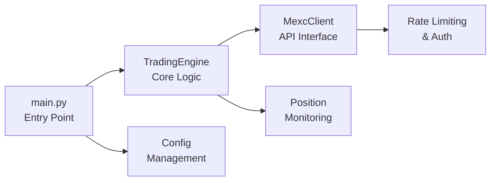

# MEXC⚡: High-Performance Crypto Trading Bot for MEXC Exchange


## 📋 Table of Contents
1. [🎯 Overview](#-overview)
2. [🏗️ Architecture & Component Analysis](#-architecture--component-analysis)
3. [⚙️ Installation & Setup](#-installation--setup)

---

## 🎯 Overview

### Purpose & Functionality
MEXC⚡ is a complex, production-ready trading bot designed for the MEXC cryptocurrency exchange. The bot provides automated trading capabilities with advanced risk management features, focusing on high-performance execution and comprehensive position monitoring.

**Core Capabilities:**
- **🤖 Automated Trading**: Execute buy/sell orders with precise timing and conditions
- **🎯 Sequential Bracket Orders**: Advanced strategy combining entry, stop-loss, and take-profit orders
- **🛡️ Risk Management**: Automatic stop-loss placement and position monitoring
- **⏰ Time-Based Trading**: Configurable trading windows for specific time periods
- **💵 USDT-Based Positioning**: Simplified position sizing using dollar amounts
- **📊 Real-Time Monitoring**: Continuous position tracking with protective order management


---


## 🏗️ Architecture & Component Analysis

### Architecture Overview

The MEXC⚡ trading bot follows a modular, async-first architecture designed for high performance and reliability:




### Component Breakdown

#### 1. **🔰 main.py**
- **Role**: CLI interface and application orchestration
- **Key Functions**:
  -  Command-line argument parsing
  -  Bot lifecycle management
  -  Time-based execution scheduling
  -  Error handling and graceful shutdown


#### 2. **📈 Trading Engine** (trading_engine.py)
- **Role**: Core trading logic and strategy execution
- **Key Functions**:
  -  Order placement and management
  -  USDT-based quantity calculation
  -  Stop-loss automation
  -  Position monitoring and lifecycle management
  -  Sequential bracket order implementation
  -  Risk management protocols


#### 3. **🔌 MEXC Client** (mexc_client.py)
- **Role**: High-performance MEXC API client
- **Key Functions**:
  -  Async HTTP client with connection pooling
  -  HMAC SHA256 authentication
  -  Rate limiting and request throttling
  -  Symbol validation and exchange info retrieval
  -  Multiple order type support
  -  Error handling and retry mechanisms


#### 4. **⚙️ Configuration** (config.py)
- **Role**: Configuration management and validation
- **Key Functions**:
  -  Environment variable loading
  -  Default value management
  -  Credential handling


---


## ⚙️ Installation & Setup

### 📋 Prerequisites
- **🐍 Python 3.8+** (recommended: Python 3.9 or higher)
- **🏦 MEXC Exchange Account** with API access enabled
- **🔑 Valid API credentials** with trading permissions
- **💻 Windows/Linux** compatible

### 💿 Step-by-Step Installation

#### 1. Environment Setup
```bash
# Create virtual environment (recommended)
python -m venv mexc_env
source mexc_env/bin/activate  # Linux
# or
mexc_env\Scripts\activate     # Windows
# or
conda activate your_environment_name     # If you're using conda

# Install dependencies
pip install -r requirements.txt
```


#### 2. API Configuration
```bash
# Copy environment template
cp env_example.txt .env

# Edit .env with your credentials
# Required:
MEXC_API_KEY=your_actual_api_key_here
MEXC_SECRET_KEY=your_actual_secret_key_here

# Optional but recommended:
DRY_RUN=true                    # Start in test mode
TRADING_SYMBOL=XRPUSDT          # Default trading pair
TRADING_QUANTITY=2.0          # Default order size (USDT)
```

#### 3. Verification
```bash
# Test MEXC API
python test_api.py

# Test API connectivity
python main.py --action test-permissions

# Validate your trading symbol
python main.py --action validate --symbol XRPUSDT

# Find tradeable symbols
python main.py --action symbols --search BTC
```

Execute the PowerShell script below to generate a `tradable_pairs.txt` file.
This file will list all symbols that support **spot trading** on the MEXC exchange.

```powershell
.\find_tradeables.ps1
```

### 📦 Dependencies Analysis

**Core Dependencies:**

```1:12:requirements.txt
requests>=2.31.0
aiohttp>=3.9.0
asyncio>=3.4.3
python-dotenv>=1.0.0
pydantic>=2.5.0
pytz>=2023.3
schedule>=1.2.0
websockets>=12.0
cryptography>=41.0.0
pandas>=2.1.0
numpy>=1.25.0
loguru>=0.7.0
```

|  Package |  Purpose |
|---------|---------|
| `🌐 aiohttp` | High-performance async HTTP client |
| `✅ pydantic` | Data validation and configuration management |
| `📝 loguru` | Advanced logging with rotation |
| `🔐 cryptography` | HMAC authentication for MEXC API |
| `🌍 python-dotenv` | Environment variable management |

---


